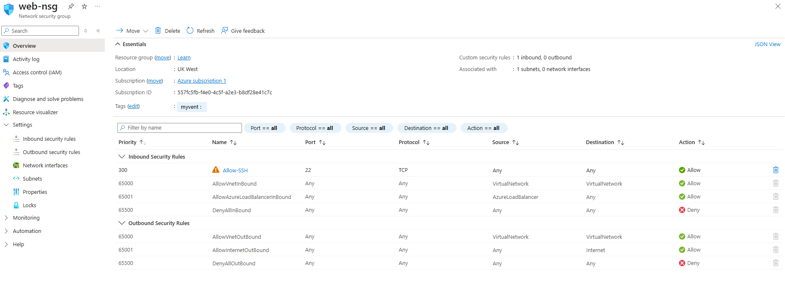
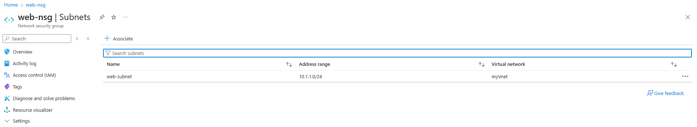

# 01 - Create VNet with NSG and Subnets

## Objectives
In this section, we'll learn how to create a Virtual Network (VNet), define multiple subnets, and associate a Network Security Group (NSG) using different methods.

---

## 📌 Requirements

- Azure Subscription
- Resource Group created (or create during process)

---

## 🧭 Steps Overview

1. Create a VNet
2. Create subnets ( Web & DB)
3. Create and configure a Network Security Group (NSG)
4. Associate NSG with a subnet

---

## 🔧 Option 1: Azure Portal

1. Navigate to **Virtual Networks** > **Create**
2. Provide:
   - Name: `myVNet`
   - Region: Choose one (e.g., East US)
   - Address space: `10.1.0.0/16`
3. Under **Subnets**, create:
   - `web-subnet`: `10.1.1.0/24`
   - `db-subnet`: `10.1.2.0/24`
  


4. Create a **Network Security Group**:
   - Name: `web-nsg`
   - Add inbound rule:
     - Port: `22`
     - Source: `Any`
     - Action: `Allow`
5. Associate `web-nsg` with `web-subnet`







---

## 💻 Option 2: Azure CLI

```bash
# Variables
rg="rg-networking"
location="eastus"
vnetName="vnet-hub"
nsgName="nsg-web"
subnetName="subnet-web"

# Create RG
az group create --name $rg --location $location

# Create VNet with subnet
az network vnet create \
  --resource-group $rg \
  --name $vnetName \
  --address-prefix 10.0.0.0/16 \
  --subnet-name $subnetName \
  --subnet-prefix 10.0.1.0/24

# Create NSG
az network nsg create \
  --resource-group $rg \
  --name $nsgName

# Add NSG rule to allow SSH
az network nsg rule create \
  --resource-group $rg \
  --nsg-name $nsgName \
  --name AllowSSH \
  --protocol Tcp \
  --direction Inbound \
  --priority 1000 \
  --source-address-prefixes '*' \
  --destination-port-ranges 22 \
  --access Allow

# Associate NSG with subnet
az network vnet subnet update \
  --resource-group $rg \
  --vnet-name $vnetName \
  --name $subnetName \
  --network-security-group $nsgName
