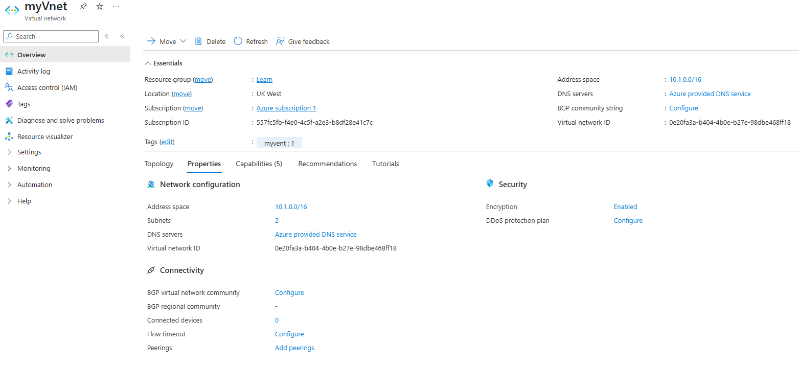

# 03 - Deploy VPN Gateway and Point-to-Site VPN

## 🎯 Objective

Enable secure remote access to your Azure virtual network using a **VPN Gateway** with **Point-to-Site (P2S)** configuration.

---

## 🧭 Requirements

- Existing **Virtual Network (VNet)** in Azure
- Address space large enough for the **GatewaySubnet**
- A **GatewaySubnet** (must be named exactly this)
- VPN Gateway (route-based)
- Point-to-Site configuration using:
  - **Tunnel Type**: SSTP + IKEv2 (or OpenVPN for cross-platform)
  - **Authentication**: Azure certificate (for lab) or Azure AD (optional)

---

## 🛠️ Steps via Azure Portal

### 1. Create GatewaySubnet

1. Go to your VNet
2. Under **Subnets**, click **+ Gateway subnet**
3. Use address range (`10.0.255.0/27`)  
4. Click **OK**

---

### 2. Create VPN Gateway

1. Go to **Create a resource > Networking > Virtual network gateway**
2. Fill in the fields:
   - Name: `hub-vpn-gateway`
   - Region: same as VNet
   - Gateway type: `VPN`
   - VPN type: `Route-based`
   - SKU: `VpnGw1` (or `Basic` for lab/demo)
   - Virtual Network: Select `hub-vnet`
   - Public IP: Create new `hub-vpn-ip`

3. Click **Review + create**, then **Create**

> 🕒 May take up to 30 minutes to deploy.

---

### 3. Configure Point-to-Site (P2S) VPN

1. Go to your **Virtual network gateway**
2. Click **Point-to-site configuration > Configure now**
3. Enter:
   - Address pool: `172.16.0.0/24` (for P2S clients)
   - Tunnel type: IKEv2 + SSTP (or OpenVPN)
   - Auth type: Azure certificate (upload root cert)

4. Save configuration  
5. Download **VPN client** after configuration is complete

---

## ⚡ Azure CLI Steps

