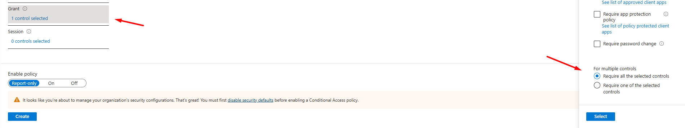
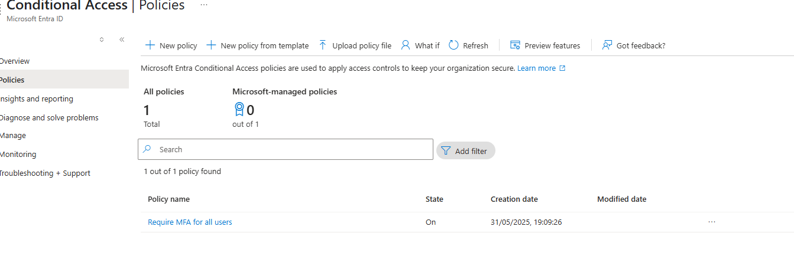

## Configure Conditional Access Policies

## Objective
This section outlines the steps to configure Conditional Access (CA) policies to enforce secure access to Azure resources.

## Step 1: Sign In to Azure Portal

1. Navigate to [https://portal.azure.com](https://portal.azure.com).
2. Use an account with appropriate permissions (e.g., Security Administrator or Global Administrator).

## Step 2: Access Conditional Access

1. In the search bar, type **Conditional Access** and select it.
2. From the left pane, click on **Policies**.

## Step 3: Create a New Policy

1. Click **+ New policy**.
2. Enter a name for your policy (e.g., `Require MFA for all users`).

## Step 4: Assign Users or Groups

1. Under **Assignments > Users**, click **Select users and groups**.
2. Choose specific users or a group (e.g., `Admins`).

## Step 5: Configure Cloud Apps or Actions

1. Under **Assignments > Cloud apps or actions**, choose:
   - **Select apps** → Pick apps like `Microsoft Office 365` or `All cloud apps`.

## Step 6: Grant Controls

1. Under **Access controls > Grant**, select:
   - ✅ **Require multi-factor authentication**
2. Click **Select**.

## Step 7: Enable and Create Policy

1. Under **Enable policy**, set it to **On**.
2. Click **Create**.

---
