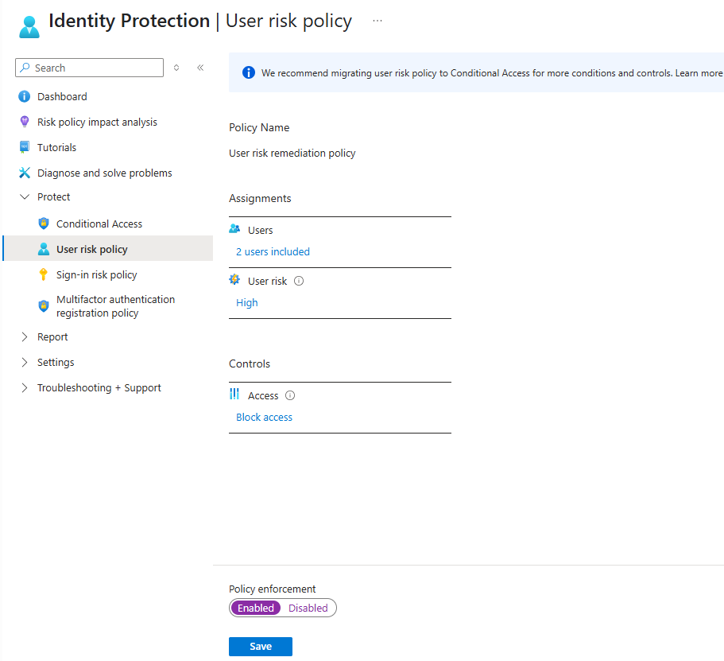

## Configure Identity Protection in Azure AD

Azure AD Identity Protection helps you detect and respond to identity-based risks, such as compromised accounts or risky sign-ins.

---

## 📌 Prerequisites

> 🛑 **Note**: Azure AD Premium P2 license is required for full Identity Protection features.

---

## Step 1: Open Identity Protection

1. Sign in to [https://portal.azure.com](https://portal.azure.com).
2. In the search bar, type **Identity Protection** and open the blade.

---

## Step 2: Configure Risk Policies

Navigate to the following sections to configure policies:

### 🔹 User Risk Policy

1. Select **User risk policy**.
2. Click **+ Create** or **Edit**.
3. Configure:
   - **Users**: Select users or groups to apply this policy to.
   - **User risk**: Set to `High`.
   - **Access**: Choose **Block access**.

### 🔹 Sign-in Risk Policy

1. Select **Sign-in risk policy**.
2. Choose:
   - **Sign-in risk level**: Medium and above.
   - **Grant**: Require multi-factor authentication (MFA).
   - Enable the policy.

---

## Step 3: Review Risky Users and Sign-ins

1. Under **Reports**, review:
   - **Risky users**
   - **Risky sign-ins**
   - **Risk detections**

---

## Step 4: Remediate Risks

1. For each risky user or sign-in:
   - Investigate the risk level.
   - Confirm compromise or dismiss the alert.
   - Take remediation actions (e.g., reset password, block sign-in).

---
